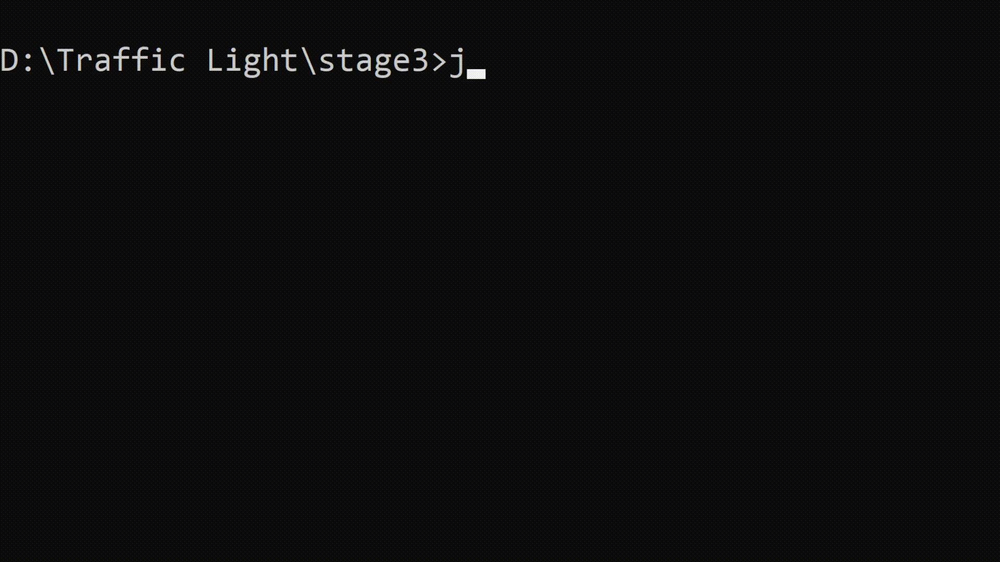
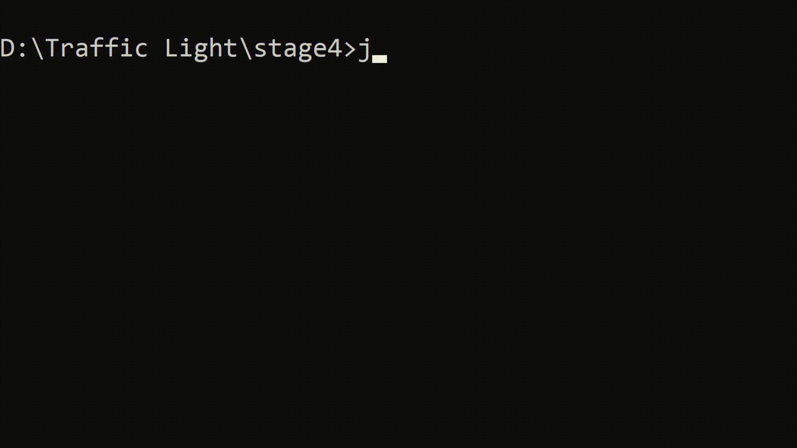

# Traffic Light Simulator with Java 

See the [project page on Hyperskill](https://hyperskill.org/projects/288) for a thorough overview.


## Stage 1/6: Open the control panel

### Description

Let's output the starting menu that greets users and shows them a list of four possible options. We will use this menu in later stages.

### Objectives

As a start, develop a simple program that prints six non-empty lines to the output.

1. Being a very polite program, it greets users on the first line with the `Welcome` substring and tells them that they've just started `traffic management system`.
2. The following line is the list's title, with `Menu` substring.
3. After that, finally, display the list line-by-line in exact order, indexing and substrings:
```text
1. Add
2. Delete
3. System
0. Quit
```

In further stages we will control the traffic light system with these actions.

### Example

```text
Welcome to the traffic management system!
Menu:
1. Add
2. Delete
3. System
0. Quit
```


## Stage 2/6: Set up the traffic light

### Description

What is a system without parameters? The traffic light should work the way users want it. Everything is simple — provide input and get the corresponding program's output.

### Objectives

In this stage, after the welcoming line, ask the users to `input` the desired `number` of roads and `input` the `interval` at which the roads should open/close. After each request, read the value that a user provides.

Next, implement a looped selection menu. The loop (as well as the program execution) ends when a user selects `0` as the desired option. Any other option (`1`, `2`, `3`) prints an informational text on the action performed (`add`, `delete`, `system`) for each option.

### Example

The greater-than symbol followed by a space (`> `) represents the user input. Note that it's not part of the input.

```text
Welcome to the traffic management system!
Input the number of roads: > 5
Input the interval: > 3
Menu:
1. Add road
2. Delete road
3. Open system
0. Quit
> 1
Road added
Menu:
1. Add road
2. Delete road
3. Open system
0. Quit
> 2
Road deleted
Menu:
1. Add road
2. Delete road
3. Open system
0. Quit
> 3
System opened
Menu:
1. Add road
2. Delete road
3. Open system
0. Quit
> 0
Bye!
```


## Stage 3/6: Oops, wrong button

### Description

What if users didn't get enough sleep? All night they controlled the movement of imaginary roads and in the morning, struggling with sleep and misclicks, enter the incorrect parameters. The system should handle wrong input and print appropriate feedback.

In this stage, let's expand our program with error handling and some visual improvements.

The number of roads and intervals at which the roads should open/close should be positive integer values (note, that `0` is not a positive value), so if a user provided any other input, our system should print an error that contains the `Incorrect input` and `Try again` substrings.

The selected option in the menu should be either `0`, `1`, `2` or `3`, so if a user made a mistake, our system should print the `Incorrect option` feedback.

To make the output of our program more convenient, we can clear the previous output after each menu option is executed. Due to the cross-platform nature of Java, clearing the console output can be complicated. You can use this snippet to remove the console output.
```java
try {
  var clearCommand = System.getProperty("os.name").contains("Windows")
          ? new ProcessBuilder("cmd", "/c", "cls")
          : new ProcessBuilder("clear");
  clearCommand.inheritIO().start().waitFor();
}
catch (IOException | InterruptedException e) {}
```
However, it would be difficult for users to get familiar with the result of the execution before the information is cleared, so after each operation, the program must wait for a new line to be entered before the next iteration.

**Note:** Clearing won't work in IntelliJ IDEA console. For that to show up you'll need to run a solution from a terminal.

We won't test how you clear the console. If you choose to display the output as solid text, make sure that your program still waits for a new line after option execution.

### Objectives

To complete this stage, your program must comply with the following requirements:

1. If the provided input for the number of roads or interval is not a positive integer value, the program should print a line, containing `Incorrect input` and `Try again` substrings, followed by a new input.
2. If the chosen option is something other than `0`, `1`, `2`, or `3`, the program should output an `Incorrect option` feedback.
3. Modify the infinite loop so that when the result of option execution is shown, the program requires any input before the next iteration.

### Example

**Note:** From this stage and beyond, the example will contain the gif representation of program running and an attached transcription block that contains the most important information. Text that starts with `//` is a comment, the greater-than symbol followed by a space `> ` represents the user input.



<details>
<summary>Transcription</summary>
```text
Welcome to the traffic management system!
Input the number of roads: > -1
Error! Incorrect Input. Try again: > Hello
Error! Incorrect Input. Try again: > 0
Error! Incorrect Input. Try again: > 5
Input the interval: > -5
Error! Incorrect Input. Try again: > World
Error! Incorrect Input. Try again: > 0
Error! Incorrect Input. Try again: > 3
// Output cleared
Menu:
1. Add road
2. Delete road
3. Open system
0. Quit
> 4
Incorrect option
>
// Output cleared
Menu:
1. Add road
2. Delete road
3. Open system
0. Quit
> -1
Incorrect option
>
// Output cleared
Menu:
1. Add road
2. Delete road
3. Open system
0. Quit
> Hello world
Incorrect option
>
// Output cleared
Menu:
1. Add road
2. Delete road
3. Open system
0. Quit
> 2
Road deleted
>
// Output cleared
Menu:
1. Add road
2. Delete road
3. Open system
0. Quit
> 0
Bye!
```
</details>


## Stage 4/6: Like a clockwork

### Description

Creating a whole system at once is challenging, so we will start with a simple stopwatch in the new thread.

Let's assume that our program has three possible states:

- **Not Started** — the state until the initial settings have been provided;
- **Menu** — the state we worked with earlier. It shows possible options and processes the user's input;
- **System** — the state that shows the user information about our traffic light, such as time from startup and initial settings for now.

When the user provided input for initial settings (both the number of roads and the interval), create a new thread to implement the **System** state. Name it as `QueueThread` by calling its `setName()` method with the corresponding string argument. The actions this newly-created thread should perform for now each second are:

- Increasing the variable that corresponds to the amount of time since the "system startup" each second (1000 milliseconds);
- (if in System state) Printing the system information.

Let's add new functionality to the `Open system` menu option. By choosing `3` option in Menu, the program switches to the System state, and the **main thread waits for input from the user**. To return to the Menu state, the user should press Enter, in other words, an empty string should be provided as input.

Example of system information output:
```text
! 3s. have passed since system startup !
! Number of roads: 1 !
! Interval: 1 !
! Press "Enter" to open menu !
```

**Note:** From this stage and beyond, the testing process can take some time.

### Objectives

Implement the System state as described above and set its thread name as `QueueThread`. While your program is in the System state, the output should contain the following information, updated (printing out) each second:

1. The line that shows the time since the program's start (contains only one integer — the number of seconds);
2. The line that indicates the number of roads provided by the user (includes the `number` substring and only one integer — the same value that was provided in the settings);
3. The line that shows the interval provided by the user (contains the `interval` substring and only one integer — the same value that was provided in the settings);
4. The line that asks the user to press Enter to open the menu (should contain the `Enter` substring)

When the user provided an empty input, the program should switch back to the Menu state and show the previously implemented menu.

**Note:** The created `QueueThread` thread should be terminated when the program is finished.

### Example



<details>
<summary>Transcription</summary>
```text
Welcome to the traffic management system!
Input the number of roads: > 5
Input the interval: > 3
// Started counting seconds
Menu:
1. Add road
2. Delete road
3. Open system
0. Quit
// 1 second passed
> 3
! 1s. have passed since system startup !
! Number of roads: 5 !
! Interval: 3 !
! Press "Enter" to open menu !
// 1 second passed
! 2s. have passed since system startup !
! Number of roads: 5 !
! Interval: 3 !
! Press "Enter" to open menu !
// 1 second passed
! 3s. have passed since system startup !
! Number of roads: 5 !
! Interval: 3 !
! Press "Enter" to open menu !
// 1 second passed
! 4s. have passed since system startup !
! Number of roads: 5 !
! Interval: 3 !
! Press "Enter" to open menu !
>
Menu:
1. Add road
2. Delete road
3. Open system
0. Quit
// 3 seconds passed
> 3
! 7s. have passed since system startup !
! Number of roads: 5 !
! Interval: 3 !
! Press "Enter" to open menu !
// 1 second passed
! 8s. have passed since system startup !
! Number of roads: 5 !
! Interval: 3 !
! Press "Enter" to open menu !
// 1 second passed
! 9s. have passed since system startup !
! Number of roads: 5 !
! Interval: 3 !
! Press "Enter" to open menu !
>
Menu:
1. Add road
2. Delete road
3. Open system
0. Quit
> 0
Bye!
```
</details>
